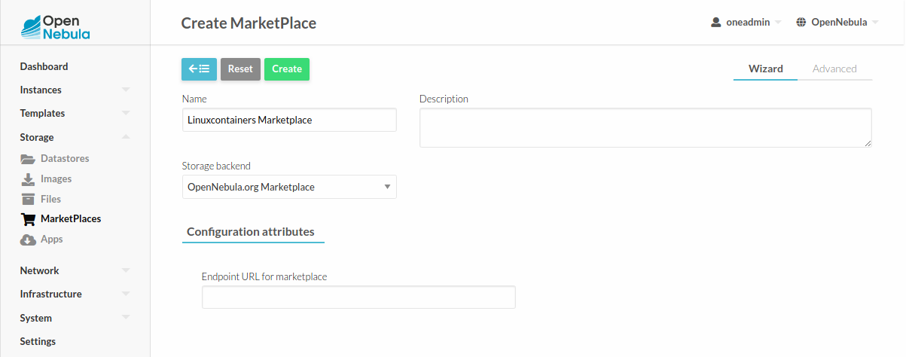

.. _onezone_serversync:

================================================================================
Linux Containers Images Marketplace
================================================================================

Overview
================================================================================

   This marketplace enables OpenNebula users to directly fetch images from the `Linux Containers Image Server <https://us.images.linuxcontainers.org>`_. Every image listed on that server will be discovered by the marketplace driver and will be shown in the form of **Distribution**_**Release**. Amd64 architecture and the last available build date will always be used.

Usage
================================================================================

To use this marketplace, you need to have installed **OpenNebula CLI Extensions**. Then you will need to modify **/etc/one/oned.conf** and add the following snippet under **MarketPlace Driver Behavior Configuration** section:

Oned.conf section::

   MARKET_MAD_CONF = [
      NAME = "linuxcontainers",
      SUNSTONE_NAME  = "Linuxcontainers",
      REQUIRED_ATTRS = "",
      APP_ACTIONS = "monitor",
      PUBLIC = "yes"
   ]

Restart OpenNebula and you are ready to add the new marketplace via Sunstone.

.. prompt:: bash # auto

   # systemctl restart opennebula

Open Sunstone and go to **Storage** --> **MarketPlaces** --> **Add**. Set a custom Name and select **Linuxcontainer** as storage backend.

