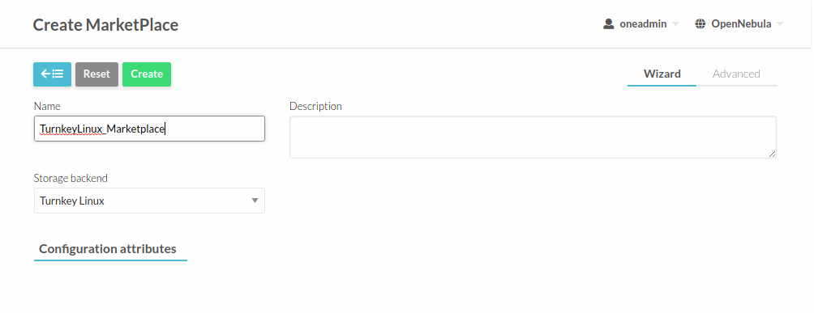

.. _turnkey_matketplace:

================================================================================
Turnkey Linux Images Marketplace
================================================================================

Overview
================================================================================

   This marketplace enables OpenNebula users to directly fetch images from `Turnkey Linux Image Server <https://www.turnkeylinux.org/>`_. Every image listed on that server will be discovered by the marketplace driver and will be shown in the form of **Appliance**_**Distribution**. Amd64 architecture will be used.

Usage
================================================================================

To use this marketplace, you need to install first **OpenNebula Market Addon**, see: :ref:`addon_market_install_guide`. Then you will need to modify **/etc/one/oned.conf** and add the following snippet under **MarketPlace Driver Behavior Configuration** section:

*oned.conf* section::

   MARKET_MAD_CONF = [
      NAME = "turnkeylinux",
      SUNSTONE_NAME  = "Turnkey_Linux",
      REQUIRED_ATTRS = "",
      APP_ACTIONS = "monitor",
      PUBLIC = "yes"
   ]

Also, you will have to modify the following section on *oned.conf*::

   MARKET_MAD = [
       EXECUTABLE = "one_market",
       ARGUMENTS  = "-t 15 -m http,s3,one,linuxcontainers"
   ]

and add **turnkeylinux** as shown below::

   MARKET_MAD = [
       EXECUTABLE = "one_market",
       ARGUMENTS  = "-t 15 -m http,s3,one,linuxcontainers,turnkeylinux"
   ]

Restart OpenNebula and you are ready to add the new marketplace via Sunstone.

.. prompt:: bash # auto

   # systemctl restart opennebula

Open Sunstone and go to **Storage** --> **MarketPlaces** --> **Add**. Set a custom Name and select **Turnkey_Linux** as storage backend.

